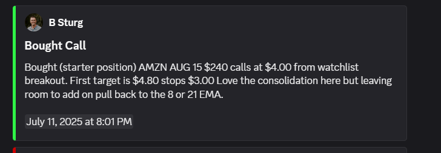

# 📈 Smart Data Trading Announcement Scraper Bot

This bot scrapes **announcements** from [Smart Data Trading](https://portal.smartdatatrading.com), detects new alerts in real-time, and sends them to a Discord channel using a webhook embed.



---

## 🔧 Setup

### 1. Clone the Repository

```bash
git clone https://github.com/bilal-the-dev/Smart-Data-Trading-Scraper-Discord-Bot scraperBot
cd scraperBot
```

### 2. Install Dependencies

```bash
npm install
```

---

## 📁 .env Configuration

Create a `.env` file in the root directory with the following values:

```env
NODE_ENV='production' | 'development'
DISCORD_WEBHOOK_URLS=https://discord.com/api/webhooks/xxx/your-webhook-id,https://discord.com/api/webhooks/x/xxxx-x
DISCORD_ERROR_WEBHOOK_URL=https://discord.com/api/webhooks/xxx/your-webhook-id,https://discord.com/api/webhooks/x/xxxx-x
USER_AGENT=Mozilla/5.0 (Windows NT 10.0; Win64; x64) AppleWebKit/537.36 (KHTML, like Gecko) Chrome/114.0.0.0 Safari/537.36
SMART_DATA_TRADING_URL=https://portal.smartdatatrading.com
SMART_DATA_REMEMBER_COOKIE=remember_web_59ba36addc2b2f9401580f014c7f58ea4e30989d=eyJpdiIxxxxx
```

### 🔑 Details:

- **`NODE_ENV`**
  If set to 'development', it'll send 10 alerts as test on startup

- **`DISCORD_WEBHOOK_URLs`**
  The webhook URLs where the bot will send new announcements as Discord embeds.

- **`DISCORD_WEBHOOK_URLs`**
  The webhook URL where error log will be sent.

- **`USER_AGENT`**
  Default is fine

- **`SMART_DATA_TRADING_URL`**
  The base URL to scrape announcements from (usually doesn't need to change).

- **`SMART_DATA_REMEMBER_COOKIE`**
  This is a long-lived cookie required to access announcement data.
  👉 You can retrieve it from your browser via **Inspect > Application > Cookies > portal.smartdatatrading.com**
  The cookie is valid for up to **1 year**.

---

## ▶️ Run the Bot

```bash
npm run start
```

## 🧠 Features

- Sends **new announcements only**, with embed-style formatting
- Detects changes in real-time and caches previously seen alerts
- Includes:

  - Announcement type and color
  - Timestamp (`<t:...:f>` format)
  - Clean alert titles

---

## 🛠 Built With

- TypeScript
- Native `fetch` API
- Discord Webhooks
- HTML scraping + parsing

---
